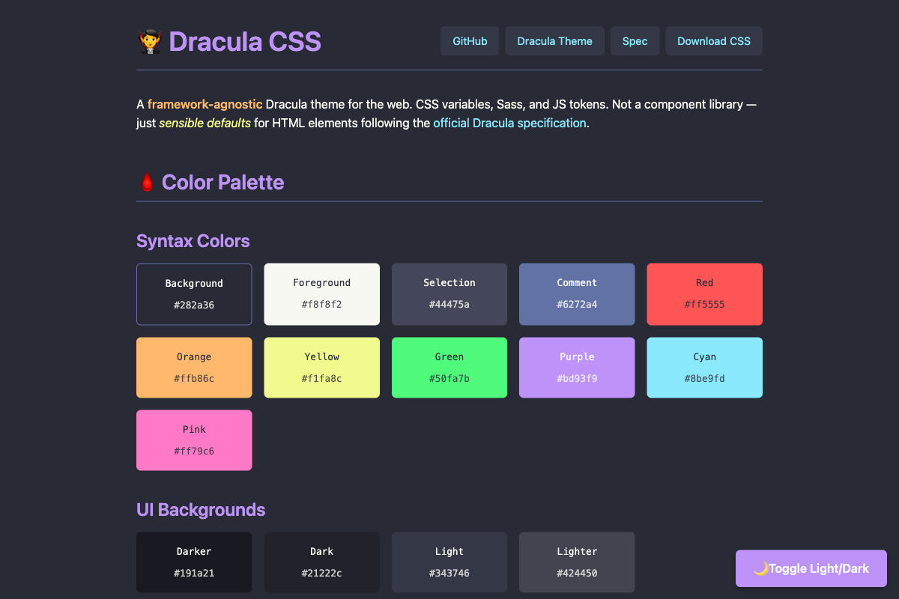

# Dracula CSS

> Framework-agnostic Dracula theme for the web — CSS variables, Sass, and JS tokens.



## Live Demo

**[View the live demo →](https://draculatheme.com/css)**

## 🧛 What This Is (And What It Isn't)

**dracula-css is NOT a component library.** It's:

- A **design token system** (colors, spacing, typography)
- **Base element styling** (sensible defaults for HTML elements)
- **Framework-agnostic** — use with React, Vue, Svelte, plain HTML, whatever

Think: **"Normalize.css meets Dracula colors"** — not **"Bootstrap but Dracula"**

### Why This Exists

| Aspect | dracula-ui (archived) | dracula-css |
|--------|----------------------|-------------|
| **Scope** | Full React component library | Variables + base element styling only |
| **Framework** | React-first | Framework-agnostic — pure CSS/Sass |
| **Dependencies** | React, TypeScript, TSDX | Zero runtime deps |
| **Maintenance** | High — components need updates | Low — CSS variables are stable |
| **Competition** | Competing with Tailwind, shadcn | Not competing — complementary foundation |
| **Use case** | "Build sites with Dracula UI" | "Add Dracula colors to your existing stack" |

## 🦇 Install

All instructions can be found at [draculatheme.com/css](https://draculatheme.com/css).

### Quick Start (CDN)

```html
<link rel="stylesheet" href="https://cdn.jsdelivr.net/npm/dracula-css/dist/dracula.min.css">
```

### npm

```bash
npm install dracula-css
```

```js
// Import in your JS/CSS
import 'dracula-css/dist/dracula.css';
```

### Sass

```scss
// Import variables only
@use 'dracula-css/src/scss/variables';

// Or import everything
@use 'dracula-css/src/scss/dracula';
```

### CSS-in-JS

```js
import { dracula, alucard } from 'dracula-css/dist/dracula-tokens.js';

// Use in styled-components, Emotion, etc.
const styles = {
  backgroundColor: dracula.colors.bg,
  color: dracula.colors.fg,
};
```

## ⚰️ What's Included

| File | Use Case |
|------|----------|
| `dist/dracula.css` | Full bundle — variables + base styles |
| `dist/dracula.min.css` | Minified production bundle |
| `dist/dracula-variables.css` | Just CSS custom properties (no base styles) |
| `dist/dracula-tokens.js` | JS/TS export for CSS-in-JS |
| `src/scss/*` | Sass source files for customization |

## 🩸 Color Architecture

Following the [official Dracula specification](https://spec.draculatheme.com/):

### Three Color Layers

**1. Syntax Palette** — For prose/content (bright, high contrast)
```css
--drac-bg: #282a36;
--drac-fg: #f8f8f2;
--drac-purple: #bd93f9;
--drac-pink: #ff79c6;
/* ... and more */
```

**2. UI Background Scale** — For surfaces and elevation
```css
--drac-ui-bg-darker: #191a21;
--drac-ui-bg-dark: #21222c;
--drac-ui-bg-light: #343746;
--drac-ui-bg-lighter: #424450;
```

**3. Functional Colors** — For UI interactions (buttons, alerts, validation)
```css
--drac-ui-error: #de5735;
--drac-ui-warning: #a39514;
--drac-ui-success: #089108;
--drac-ui-info: #0081d6;
--drac-ui-focus: #815cd6;
```

Per the spec: *"Functional colors are UI-specific colors for interactive elements, borders, and indicators. Do not use in editor or terminal applications."*

### 🌙 Dark/Light Mode

Dracula CSS supports both dark (Dracula) and light (Alucard) modes:

```html
<!-- Automatic (follows system preference) -->
<html>

<!-- Force dark mode -->
<html class="dracula-dark">

<!-- Force light mode -->
<html class="dracula-light">
```

## Base Element Styling

Includes sensible defaults for:

- **Typography**: h1-h6, p, a, strong, em, small, mark, del, ins
- **Code**: code, pre, kbd, samp, var
- **Lists**: ul, ol, li, dl, dt, dd
- **Tables**: table, th, td, caption (with striped rows)
- **Forms**: input, textarea, select, button, label, fieldset
- **Misc**: blockquote, hr, details/summary, abbr

**Explicitly NOT included** (by design):

- Layout utilities (flexbox helpers, grid systems)
- Component classes (.card, .modal, .alert)
- JavaScript behaviors
- Complex animations

## CSS Variables Reference

All variables are prefixed with `--drac-` to avoid conflicts:

```css
/* Colors */
--drac-bg, --drac-fg, --drac-selection, --drac-comment
--drac-red, --drac-orange, --drac-yellow, --drac-green
--drac-purple, --drac-cyan, --drac-pink

/* UI Backgrounds */
--drac-ui-bg-darker, --drac-ui-bg-dark
--drac-ui-bg-light, --drac-ui-bg-lighter, --drac-ui-float

/* Functional */
--drac-ui-error, --drac-ui-warning, --drac-ui-success
--drac-ui-info, --drac-ui-focus

/* Semantic */
--drac-heading-color, --drac-link-color, --drac-link-hover-color
--drac-strong-color, --drac-emphasis-color, --drac-code-color

/* Typography */
--drac-font-family, --drac-font-family-mono
--drac-font-size-base, --drac-line-height

/* Spacing */
--drac-spacing-xs, --drac-spacing-sm, --drac-spacing-md
--drac-spacing-lg, --drac-spacing-xl

/* Borders */
--drac-border-radius, --drac-border-color

/* Transitions */
--drac-transition-duration, --drac-transition-timing

/* ANSI Colors (terminal emulators) */
--drac-ansi-black, --drac-ansi-red, --drac-ansi-green, --drac-ansi-yellow
--drac-ansi-blue, --drac-ansi-magenta, --drac-ansi-cyan, --drac-ansi-white
--drac-ansi-bright-black, --drac-ansi-bright-red, --drac-ansi-bright-green
--drac-ansi-bright-yellow, --drac-ansi-bright-blue, --drac-ansi-bright-magenta
--drac-ansi-bright-cyan, --drac-ansi-bright-white
```

## 🏰 Team

This theme is maintained by the following person(s) and a bunch of [awesome contributors](https://github.com/dracula/css/graphs/contributors).

| [](https://github.com/jamesfishwick) |
| --- |
| [James Fishwick](https://github.com/jamesfishwick) |

## 🦇 Community

- [Twitter](https://twitter.com/draculatheme) — Best for getting updates about themes and new stuff.
- [GitHub](https://github.com/dracula/dracula-theme/discussions) — Best for asking questions and discussing issues.
- [Discord](https://draculatheme.com/discord-invite) — Best for hanging out with the community.

## Related

- [dracula-markdown-css](https://github.com/dracula/markdown-css) — Dracula theme specifically for rendered markdown
- [Dracula Theme](https://draculatheme.com) — The main Dracula theme for 400+ apps
- [Dracula Spec](https://spec.draculatheme.com) — Official color specification

## License

[MIT License](./LICENSE)
